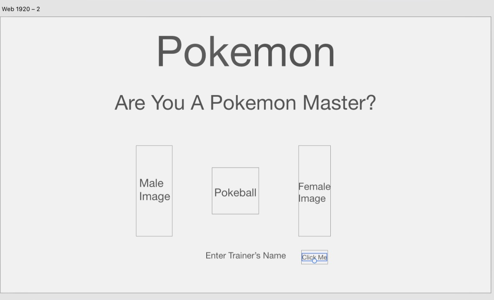

# Name that pokemon!

### pokeapi.co

You'll enter any pokemon or their pokedex number and it will load their picture with some info about them.

Could turn into a pokemon battling app. Where you randomly pick a pokemon or name one. Battle with it against a random pokemon or again a selected one.

Could instead maybe pick 6 or randomly get 6 pokemon and take a "picture" with the 6 pokemon like the pokemon champion picture in the games.

Battle simulator
name input

pikachu vs pokemon

call api to get images, stats, names, etc.
hard coding in stats will be easier.
hard coding moves
start with using one move.
css to make look like original game

strech- adding a move pull and being able to select one.
strech- add more pokemon you can fight with instead of pikachu
strech- fighting random pokemon

## hard code
pokemon names
hp
attacks

## api call
sprites

## local storage 
trainer name

# Updated Project

## Are You A Pokemon Master?

pokemonmaster.surge.sh

I wanted to try my best to replicate pokemon games on the gameboy consoles.

So we have two html files with their own js files.

The first html is a landing page where there is some css animation. There you enter your name in the input field which saves your name in the user's local storage and takes you to the next html page.

The second html page is where the game happens. . Here there is a lot going on. When the page load a audio file starts play, the pokemon api gets called two seperate times to grab each of the pokemon's image, and we take the name the user entered from the first page and put it in the first line of text using local storage.

Here there is a few animations with the arrow blinking in the bottom right and the "health bars" react to the damage from the pokemon's attacks. I do a randomizer for which attack happens per action. There are 4 possible outcomes for each pokemon's attacks. I also did a randomizer for the pokemon's image. There is a 10% change for it be a different image called "shiny". Each attack has its own damage value and I added a different audio file for each attack that happens.

Once one of the pokemon "faints" which their health reaches 0, the music changes depending on who fainted and then a button pops up in the text to "restart" the game. It will take you back to the home page where you enter your name.

## Improvements to be had

I want to add animations when the pokemon attack like images.

I would like to make the pokemon you use and the one you battle against to be random. I would have api their typing as well. Depending on their type, I would write out multiple attacks for each typing. Also add audio files for those attacks.

Being able to make this mobile accessible would be awesome. The health bars are not very responsive.

## Wireframes

